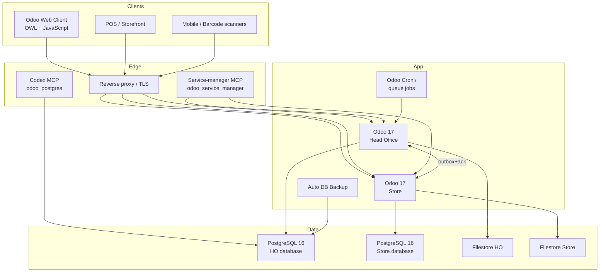
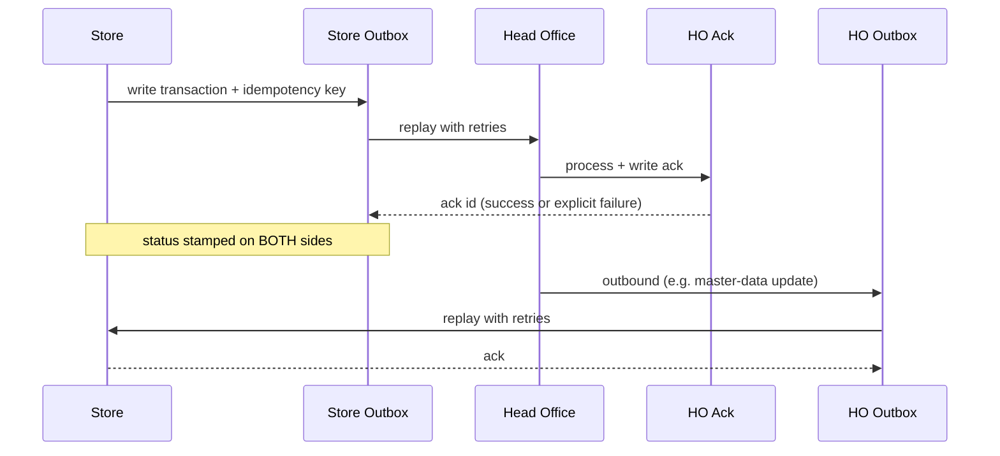

## Layers

## Deployment topology

- **Two databases**, one Docker Compose stack per deployment.
- **Head Office** runs the master data, finance books, vendor ledger, and store-target planning.
- **Store** runs the POS, daily inventory, and store-local documents.
- HO↔Store sync is implemented through the **outbox + acknowledgment** pattern (see `RetailEnterprise/HeadOffice/nhcl_ho_store_cmr_integration` and `RetailEnterprise/Store/nhcl_store_to_ho_transactions`).
- Both deployments can run **fully offline** for document creation; sync is durable and idempotent.

See [`docs/cmr-docker-deployment.md`](cmr-docker-deployment.md) and
[`docs/portable-odoodata-layout.md`](portable-odoodata-layout.md) for the
container topology and the external-SSD layout that supports the same
databases across machines.

## Module layering (what lives where)

- **`addons/`** — repo-local custom addons, currently `sale_order_extension` (approval workflow, REST API, jobs, client behavior).
- **`vendor-addons/`** — third-party modules not vendored upstream (currently `auto_database_backup`).
- **`RetailEnterprise/HeadOffice/addons/`** — HO-only customizations (35 addons).
- **`RetailEnterprise/Store/addons/`** — Store-only customizations (32 addons).
- **`RetailEnterprise/addons/`** — pinned Odoo 17 community source tree.
- **`enterprise-addons/`** — pinned Odoo 17 enterprise source tree (ignored by git, mounted at runtime).
- **`work-dir/odoo/`** — pinned reference source for the impact-graph extraction; never vendored into git.

## Finance pipeline

Every value-bearing transaction flows through the same shape:

1. **Originating document** (PI, PO, GRN, batch transfer, POS bill, return, adjustment).
2. **Stock movement event** posted to the stock ledger (immutable, append-only).
3. **Journal entry** generated against the vendor / customer / GL account, with cost center.
4. **Sync event** written to the outbox for HO↔Store replication.
5. **Reconciliation report** can always rebuild the totals from the underlying event ledger.

The detailed per-event mapping is in [Reference → Journal entry mapping](/reference/#journal-entry-mapping).

## HO ↔ Store sync

This is the **outbox + ack** pattern referenced throughout the retail build reference; it solves the
"integrated: Yes at HO but never received at the store" failure mode by making both directions
durable, idempotent, and explicitly two-sided.

## Security & access control

- Role-based access at team/group level applied to fields, menus, and dropdowns — not just pages.
- Catalog-level scoping: users restricted to assigned Family / Category / Class / Brick.
- Store-scoped access for batch-transfer-out and batch-transfer-in teams.
- Single-session login, IP restrictions, audit trail (`account_audit_trail`), TOTP for admin accounts.

See [Platform → security-identity](/platform/security-identity/) and [Platform → licensing-commercial-boundaries](/platform/licensing-commercial-boundaries/).
